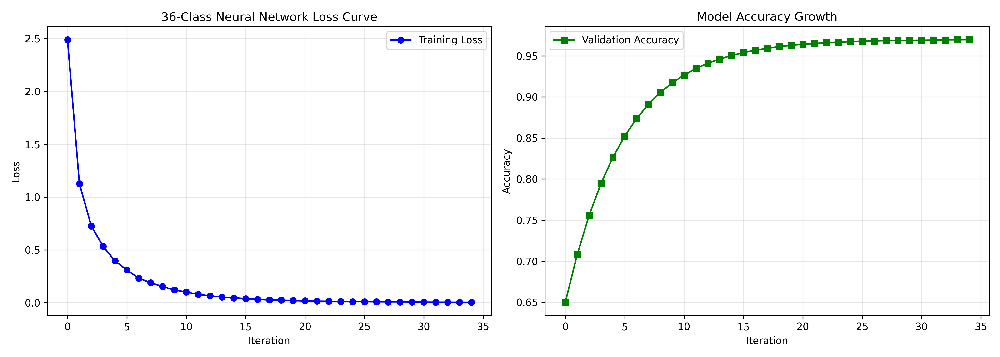

# Handwritten Character Recognition using CNN

A complete, production-ready Handwritten Character Recognition web application powered by **Deep Learning (Convolutional Neural Network)**, **Flask**, **OpenCV**, and **TensorFlow / Keras**.



## Key Features

- 🧠 **Deep Learning CNN Model**: High-accuracy Convolutional Neural Network trained on MNIST (digits 0-9) & EMNIST (letters A-Z / combined dataset).
- ✍️ **Dual Input Workbench**:
  - **Interactive Canvas**: Write digits or letters directly on screen with mouse or touch.
  - **Drag-and-Drop Image Uploader**: Supports PNG, JPG, JPEG, BMP, WEBP.
- 👁️ **OpenCV Preprocessing Pipeline Visualizer**: Step-by-step explainability showing Grayscale conversion, Otsu Binarization, ROI Contour extraction, and 28x28 Tensor centering.
- 📊 **Model Analytics Dashboard**: Built-in modal displaying Test Accuracy, Precision, Recall, F1 Score, Confusion Matrix, and Training Loss/Accuracy curves.
- 🎨 **Modern Glassmorphism UI**: Vibrant dark mode UI designed with Google Fonts (Outfit & Inter).

---

## Directory Structure

```text
handwritten_character_recognition/
├── app.py                   # Flask Web Server
├── train_model.py           # Model Training & Metric Evaluation Script
├── predict.py               # Inference Engine & Candidate Ranking
├── utils/
│   ├── __init__.py
│   └── preprocess.py        # OpenCV Image Preprocessing & Base64 Pipeline
├── templates/
│   └── index.html           # Main SPA Interface
├── static/
│   ├── css/
│   │   └── styles.css       # Complete Dark Mode CSS System
│   ├── js/
│   │   └── main.js          # Canvas Engine & API Interactivity
│   └── metrics/             # Evaluation Plots (History & Confusion Matrix)
├── uploads/                 # Temporary Image Upload Directory
├── model/                   # Model Artifacts (cnn_model.h5, metrics.json)
├── dataset/                 # Dataset Cache
├── requirements.txt         # Project Dependencies
└── README.md                # Project Documentation
```

---

## Installation & Setup

### 1. Clone or Open Project Directory
```bash
cd handwritten_character_recognition
```

### 2. Install Dependencies
```bash
pip install -r requirements.txt
```

### 3. Model Training & Evaluation
To train the CNN model on MNIST / EMNIST dataset and generate training metrics, run:
```bash
python train_model.py --epochs 8 --batch_size 128 --mode mnist
```
*Outputs generated:*
- Model saved to `model/cnn_model.h5` and `model/cnn_model.keras`
- Class mappings saved to `model/class_mapping.json`
- Evaluation graphs saved to `static/metrics/training_history.png` and `static/metrics/confusion_matrix.png`
- Detailed metrics saved to `model/metrics.json`

### 4. Run Flask Web Application
```bash
python app.py
```
Open your browser and navigate to: `http://localhost:5000`

---

## Technical Architecture

1. **Preprocessing Pipeline (`utils/preprocess.py`)**:
   - Converts BGR image to single-channel Grayscale (`cv2.cvtColor`).
   - Removes high-frequency noise using Gaussian Blur (`cv2.GaussianBlur`).
   - Applies Otsu's Adaptive Thresholding (`cv2.threshold`) to produce inverted binary white text on black background.
   - Isolates character contours (`cv2.findContours`), crops bounding box ROI, pads with aspect-ratio preservation, and centers onto a standard 28×28 grid.
   - Normalizes pixel range to `[0.0, 1.0]` for input tensor `(1, 28, 28, 1)`.

2. **Convolutional Neural Network Architecture**:
   - `Conv2D(32, (3,3))` + `BatchNormalization()` + `ReLU`
   - `Conv2D(64, (3,3))` + `BatchNormalization()` + `ReLU` + `MaxPooling2D(2,2)` + `Dropout(0.25)`
   - `Conv2D(128, (3,3))` + `BatchNormalization()` + `ReLU` + `MaxPooling2D(2,2)` + `Dropout(0.25)`
   - `Flatten()` -> `Dense(256)` + `BatchNormalization()` + `Dropout(0.5)` -> `Dense(num_classes, softmax)`
